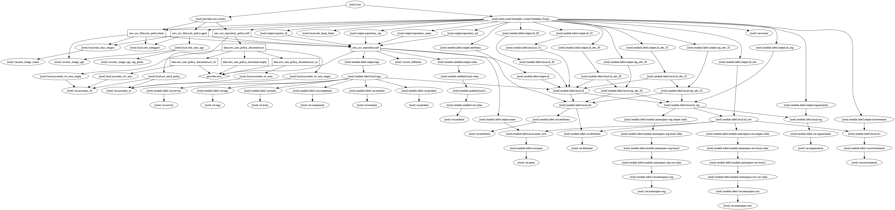

# terraform-aws-ecr

[](https://circleci.com/gh/appzen-oss/terraform-aws-ecr)
[](https://github.com/appzen-oss/terraform-aws-ecr/releases)

Terraform module to

[Terraform registry](https://registry.terraform.io/modules/appzen-oss/ecr/aws)

## Usage

### Basic Example

```hcl
module "" {
  source        = "appzen-oss/ecr/aws"
  version       = "0.0.1"
}
```

<!-- BEGINNING OF PRE-COMMIT-TERRAFORM DOCS HOOK -->
## Inputs

| Name | Description | Type | Default | Required |
|------|-------------|:----:|:-----:|:-----:|
| accounts\_ro | AWS accounts to provide with readonly access to the ECR | list | `<list>` | no |
| accounts\_rw | AWS accounts to provide with full access to the ECR | list | `<list>` | no |
| attributes | Suffix name with additional attributes (policy, role, etc.) | list | `<list>` | no |
| component | TAG: Underlying, dedicated piece of service (Cache, DB, ...) | string | `"UNDEF-ECR"` | no |
| delimiter | Delimiter to be used between `name`, `namespaces`, `attributes`, etc. | string | `"-"` | no |
| enabled | Set to false to prevent the module from creating any resources | string | `"true"` | no |
| environment | Environment (ex: `dev`, `qa`, `stage`, `prod`). (Second or top level namespace. Depending on namespacing options) | string | n/a | yes |
| max\_image\_age | Max container image age | string | `"0"` | no |
| max\_image\_age\_tag\_prefix | Tag prefix list for max image age rule | list | `<list>` | no |
| max\_image\_count | Max container images to keep | string | `"500"` | no |
| monitor | TAG: Should resource be monitored | string | `"UNDEF-ECR"` | no |
| name | Base name for resource | string | n/a | yes |
| namespace-env | Prefix name with the environment. If true, format is: `{env}-{name}` | string | `"true"` | no |
| namespace-org | Prefix name with the organization. If true, format is: `{org}-{env namespaced name}`. If both env and org namespaces are used, format will be `{org}-{env}-{name}` | string | `"false"` | no |
| organization | Organization name (Top level namespace) | string | `""` | no |
| owner | TAG: Owner of the service | string | `"UNDEF-ECR"` | no |
| product | TAG: Company/business product | string | `"UNDEF-ECR"` | no |
| service | TAG: Application (microservice) name | string | `"UNDEF-ECR"` | no |
| tags | A map of additional tags | map | `<map>` | no |
| team | TAG: Department/team of people responsible for service | string | `"UNDEF-ECR"` | no |
| use\_fullname |  | string | `"true"` | no |

## Outputs

| Name | Description |
|------|-------------|
| registry\_id | The registry ID where the repository was created |
| repository\_arn | Full ARN of repository |
| repository\_name | Repository name |
| repository\_url | Repository URL |

<!-- END OF PRE-COMMIT-TERRAFORM DOCS HOOK -->
<!-- BEGINNING OF PRE-COMMIT-TERRAFORM GRAPH HOOK -->

### Resource Graph of plan


<!-- END OF PRE-COMMIT-TERRAFORM GRAPH HOOK -->
